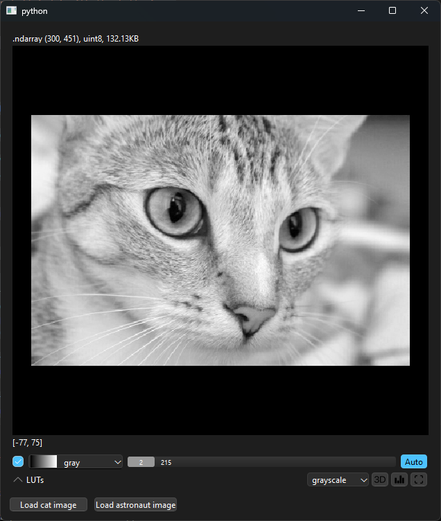
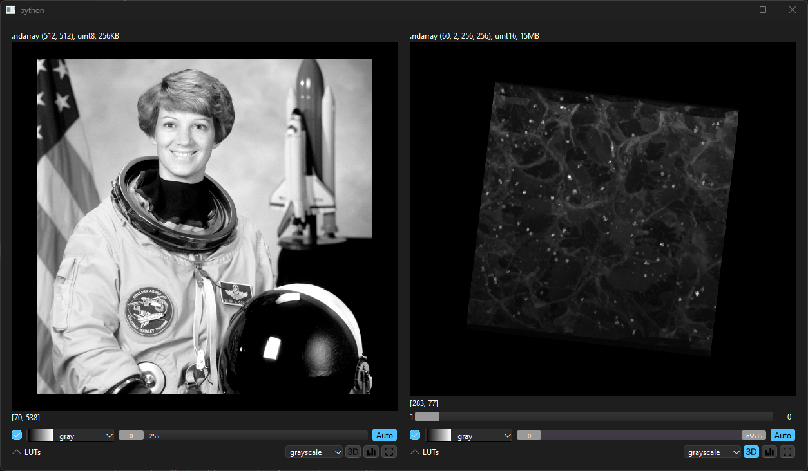
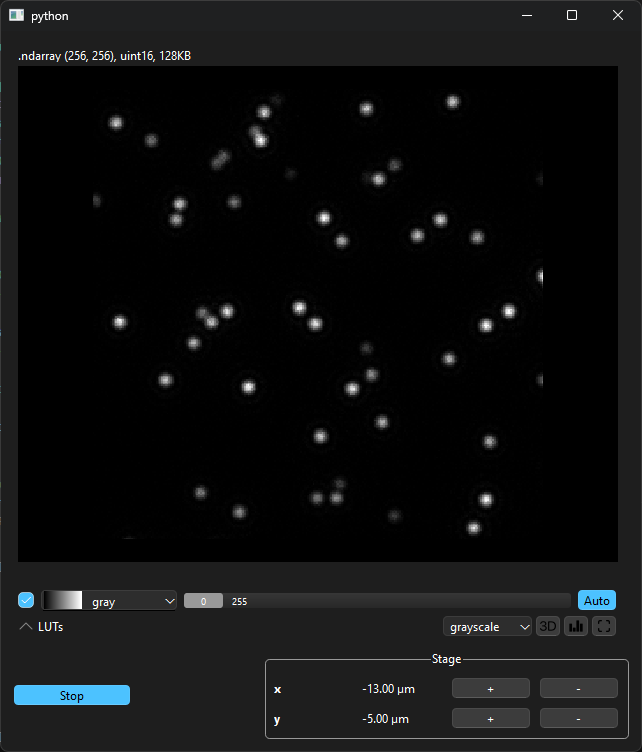

# `ndv` cookbook

This section of the documentation provides some useful recipes to use `ndv` in different contexts,
providing an example application for each possible use case.

## Embed `ArrayViewer` in a `QWidget`

`ndv` can be embedded in an existing Qt application and enriched with additional elements in a custom layout.

### Change the content of `ArrayViewer` via push buttons.

The following script shows an example on how to dynamically select a data set and load it in the `ArrayViewer`.

To run this example install `ndv` with the following command:

```bash
pip install ndv[vispy,pyqt] imageio
```

The example is located in `examples\cookbook\ndv_embedded.py`

```py
"""An example on how to embed the `ArrayViewer` controller in a custom Qt widget.

"""

from typing import TYPE_CHECKING

from qtpy import QtWidgets

from ndv import ArrayViewer, run_app
from ndv.data import astronaut, cat

if TYPE_CHECKING:
    import numpy.typing as npt


class EmbeddingWidget(QtWidgets.QWidget):

    def __init__(self) -> None:
        super().__init__()
        layout = QtWidgets.QGridLayout()
        self._data: npt.NDArray = cat()[:, :, 0]
        self._viewer = ArrayViewer(self._data)

        self._cat_button = QtWidgets.QPushButton("Load cat image")
        self._astronaut_button = QtWidgets.QPushButton("Load astronaut image")

        self._cat_button.clicked.connect(self._load_cat)
        self._astronaut_button.clicked.connect(self._load_astronaut)

        # get `ArrayViewer` widget and add it to the layout;
        # you can specify the row and column span of the widget
        layout.addWidget(self._viewer.widget(), 0, 0, 1, 5)

        # add buttons to the layout
        layout.addWidget(self._cat_button, 1, 0)
        layout.addWidget(self._astronaut_button, 1, 1)

        self.setLayout(layout)

    def _load_cat(self) -> None:
        self._viewer.data = None
        self._viewer.data = cat()[:, :, 0]

    def _load_astronaut(self) -> None:
        self._viewer.data = None
        self._viewer.data = astronaut()[:, :, 0]

app = QtWidgets.QApplication([])
widget = EmbeddingWidget()
widget.show()
run_app()
```




### Use multiple `ndv.ArrayViewer` controllers in the same widget

The following script shows an example on how to create multiple instances of the `ArrayViewer` controller in the same widget and load two different datasets in each one.

To run this example install `ndv` with the following command:

```bash
pip install ndv[vispy,pyqt] imageio
```

```py

"""An example on how to embed multiple `ArrayViewer` controllers in a custom Qt widget.

It shows the `astronaut` and `cells3d` images side by side on two different viewers.

"""

from qtpy import QtWidgets

from ndv import ArrayViewer, run_app
from ndv.data import astronaut, cells3d


class MultiNDVWrapper(QtWidgets.QWidget):

    def __init__(self) -> None:
        super().__init__()

        layout = QtWidgets.QGridLayout()
        self._astronaut_viewer = ArrayViewer(astronaut()[:, :, 0])
        self._cells_virewer = ArrayViewer(cells3d())

        # get `ArrayViewer` widget and add it to the layout
        layout.addWidget(self._astronaut_viewer.widget(), 0, 0, 4, 4)
        layout.addWidget(self._cells_virewer.widget(), 0, 5, 4, 4)

        self.setLayout(layout)


app = QtWidgets.QApplication([])
widget = MultiNDVWrapper()
widget.show()
run_app()
```



### A minimal microscope dashboard using `openwfs`

You can use `ndv` to take an external image source (i.e. a widefield camera) and show its content in real-time in a custom widget embedding `ArrayViewer`.
The script below uses `openwfs` to generate synthetic images of a sample and continously update the view, and allows to move the field of view over the X and Y axis.

To run this example install `ndv` and [`openwfs`](https://github.com/IvoVellekoop/openwfs) with the following command:

```bash
pip install ndv[vispy,pyqt] openwfs
```

```py
"""A minimal microscope dashboard.

The `SyntheticManager` acts as an microscope simulator.
It generates images of a specimen and sends them to the `DashboardWidget`.

The `DashboardWidget` is a simple GUI that displays the images and allows the user to:
- starts/stops the simulation;
- move the stage in the x and y directions.
"""

import astropy.units as u  # type: ignore
import numpy as np
import numpy.typing as npt
from openwfs.simulation import Camera, Microscope, StaticSource  # type: ignore
from psygnal import Signal
from qtpy import QtWidgets
from qtpy.QtCore import QObject, Qt, QTimer
from qtpy.QtWidgets import QApplication

from ndv import ArrayViewer


class SyntheticManager(QObject):
    sigNewFrame = Signal(np.ndarray)

    def __init__(self, parent: QObject | None = None) -> None:
        super().__init__(parent)

        self._timer = QTimer()

        specimen_resolution = (
            1024,
            1024,
        )  # height x width in pixels of the specimen image
        specimen_pixel_size = 60 * u.nm  # resolution (pixel size) of the specimen image
        magnification = 40  # magnification from object plane to camera.
        numerical_aperture = 0.85  # numerical aperture of the microscope objective
        wavelength = 532.8 * u.nm  # wavelength of the light, for computing diffraction.
        camera_resolution = (256, 256)  # number of pixels on the camera
        # camera_pixel_size = 6.45 * u.um  # Size of the pixels on the camera

        img = np.maximum(
            np.random.randint(-10000, 10, specimen_resolution, dtype=np.int16), 0
        )
        src = StaticSource(img, pixel_size=specimen_pixel_size)

        self._microscope = Microscope(
            src,
            magnification=magnification,
            numerical_aperture=numerical_aperture,
            wavelength=wavelength,
        )
        self._camera = Camera(
            self._microscope,
            analog_max=None,
            shot_noise=True,
            digital_max=255,
            shape=camera_resolution,
        )

        self._timer.timeout.connect(lambda: self.sigNewFrame.emit(self._camera.read()))

    def toggle_simulation(self, start: bool) -> None:
        if start:
            self._timer.start(100)
        else:
            self._timer.stop()

    def move_stage(self, axis: str, direction: str) -> None:
        if direction == "+":
            match axis:
                case "x":
                    self._microscope.xy_stage.x += 1 * u.um
                case "y":
                    self._microscope.xy_stage.y += 1 * u.um
        else:
            match axis:
                case "x":
                    self._microscope.xy_stage.x -= 1 * u.um
                case "y":
                    self._microscope.xy_stage.y -= 1 * u.um


class DashboardWidget(QtWidgets.QWidget):
    sigSimStarted = Signal(bool)
    sigMoveStage = Signal(str, str)

    def __init__(self) -> None:
        super().__init__()
        layout = QtWidgets.QGridLayout()
        self._start_button = QtWidgets.QPushButton("Start")
        self.labels: dict[str, QtWidgets.QLabel] = {}
        self.buttons: dict[str, QtWidgets.QPushButton] = {}
        self._stage_name = "Stage"
        axis = [
            "x",
            "y",
        ]

        self.group = QtWidgets.QGroupBox(self._stage_name)
        self.group.setAlignment(Qt.AlignmentFlag.AlignHCenter)

        group_layout = QtWidgets.QGridLayout()

        for idx, ax in enumerate(axis):
            self.labels[f"label:{self._stage_name}:{ax}"] = QtWidgets.QLabel(
                f"<strong>{ax}</strong>"
            )
            self.labels[f"label:{self._stage_name}:{ax}"].setTextFormat(
                Qt.TextFormat.RichText
            )
            self.labels[f"pos:{self._stage_name}:{ax}"] = QtWidgets.QLabel(
                f"{0:.2f} µm"
            )
            self.labels[f"pos:{self._stage_name}:{ax}"].setTextFormat(
                Qt.TextFormat.RichText
            )
            self.buttons[f"up:{self._stage_name}:{ax}"] = QtWidgets.QPushButton("+")
            self.buttons[f"down:{self._stage_name}:{ax}"] = QtWidgets.QPushButton("-")
            # signal connection
            self.buttons[f"up:{self._stage_name}:{ax}"].clicked.connect(
                lambda *_, axis=ax, dir="+": self._move_stage(
                    self._stage_name, axis, dir
                )
            )
            self.buttons[f"down:{self._stage_name}:{ax}"].clicked.connect(
                lambda *_, axis=ax, dir="-": self._move_stage(
                    self._stage_name, axis, dir
                )
            )
            group_layout.addWidget(
                self.labels[f"label:{self._stage_name}:{ax}"], idx, 0
            )
            group_layout.addWidget(self.labels[f"pos:{self._stage_name}:{ax}"], idx, 1)
            group_layout.addWidget(self.buttons[f"up:{self._stage_name}:{ax}"], idx, 2)
            group_layout.addWidget(
                self.buttons[f"down:{self._stage_name}:{ax}"], idx, 3
            )

        self.group.setLayout(group_layout)

        for button in self.buttons.values():
            button.setEnabled(False)

        self._data: npt.NDArray = np.zeros((256, 256), dtype=np.uint8)
        self._viewer = ArrayViewer(self._data)
        layout.addWidget(self._viewer.widget(), 0, 0, 1, 5)
        layout.addWidget(self._start_button, 1, 0, 1, 1)
        layout.addWidget(self.group, 1, 2, 1, 4)

        self._start_button.toggled.connect(self.start_simulation)
        self._start_button.setCheckable(True)

        self.setLayout(layout)

    def _move_stage(self, stage: str, axis: str, direction: str) -> None:
        self.sigMoveStage.emit(axis, direction)
        value = float(self.labels[f"pos:{stage}:{axis}"].text().split(" ")[0])
        if direction == "+":
            value += 1
        else:
            value -= 1
        self.labels[f"pos:{stage}:{axis}"].setText(f"{value:.2f} µm")


    def start_simulation(self, checked: bool) -> None:
        if checked:
            self._start_button.setText("Stop")
            self.sigSimStarted.emit(True)
            for button in self.buttons.values():
                button.setEnabled(True)
        else:
            self._start_button.setText("Start")
            self.sigSimStarted.emit(False)
            for button in self.buttons.values():
                button.setEnabled(False)

    def new_frame(self, frame: np.ndarray) -> None:
        self._viewer.data = frame


app = QApplication([])
manager = SyntheticManager()
wrapper = DashboardWidget()

manager.sigNewFrame.connect(wrapper.new_frame)
wrapper.sigSimStarted.connect(manager.toggle_simulation)
wrapper.sigMoveStage.connect(manager.move_stage)

wrapper.show()
app.exec()
```


