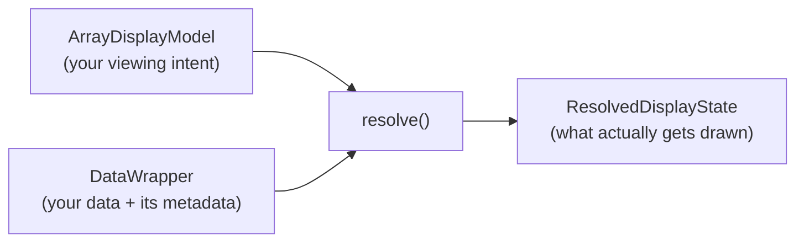

# Using `ndv`

## Quick Start

The simplest way to display an array is with [`imshow`][ndv.imshow]:

```python
import ndv

data = ndv.data.cells3d()  # or any array-like object
viewer = ndv.imshow(data)

# later, if desired:
viewer.display_model.current_index.update({0: 30})
```

This opens a viewer window with sliders for navigating through dimensions,
contrast controls, and channel display options. `imshow` creates an
[`ArrayViewer`][ndv.ArrayViewer], calls `show()`, and starts the GUI event
loop — so it's ideal for scripts and quick exploration.

You can also pass display options directly to `imshow`:

```python
ndv.imshow(
    data,
    channel_mode="composite",
    channel_axis=1,
    luts={0: {"name": "FITC"}, 1: {"name": "DAPI"}},
    current_index={0: 30},
)
```

## ArrayViewer

For more control, use [`ArrayViewer`][ndv.ArrayViewer] directly:

```python
viewer = ndv.ArrayViewer(data, channel_mode="composite")
viewer.show()
ndv.run_app()
```

`ArrayViewer` is the main object in `ndv`. It connects a *display model*
(your viewing intent) with a *data wrapper* (the actual array) and a GUI,
keeping everything synchronized. You interact with it in two complementary
ways:

1. **Through the GUI** — sliders, buttons, dropdowns, and mouse interaction.
2. **Programmatically** — by modifying the viewer's
   [`display_model`][ndv.ArrayViewer.display_model] or swapping out
   [`data`][ndv.ArrayViewer.data].

These two paths are always kept in sync. Moving a slider in the GUI updates
the display model; changing `display_model.current_index` in code moves the
slider and redraws the canvas. This means you can freely mix interactive and
scripted usage.

### Embedding in an application

`ArrayViewer` can be embedded into an existing Qt or wxPython application.
Use the [`widget()`][ndv.ArrayViewer.widget] method to get the native widget
and add it to your layout:

```python
from qtpy.QtWidgets import QMainWindow

viewer = ndv.ArrayViewer(data)
window = QMainWindow()
window.setCentralWidget(viewer.widget())
window.show()
```

See the [embedding cookbook](cookbook/embedding.md) for full examples.

## How ndv Thinks About Your Data

When you pass an array to `ndv`, two things happen behind the scenes:

1. An [`ArrayDisplayModel`][ndv.models.ArrayDisplayModel] captures *how*
   you want to view the data — which axes are visible, the current slice
   position, channel display mode, colormaps, contrast limits, and so on.
   This is your **viewing intent**, expressed in a way that is mostly
   data-agnostic: axes can be referred to by integer index (including
   negative indices like `-1`) or by string label (like `"Z"` or `"time"`).

2. A [`DataWrapper`][ndv.DataWrapper] wraps your actual array object. It
   knows how to extract metadata (dimension names, coordinates, dtype, shape)
   and how to slice data from whatever array type you're using — numpy,
   dask, xarray, zarr, tensorstore, and more.

The viewer then **resolves** these two together: your intent (the display
model) plus the reality of the data (the wrapper) produces a concrete
display state. During resolution, things like negative axis indices get
converted to positive ones, channel axes may be inferred if not specified,
coordinate labels are pulled from the data, and missing information is
filled in with sensible defaults.

Conceptually, resolution looks like this:



This separation means you can set up a display model *before* you have data,
or swap data without losing your view settings. It also means that some
information — like channel names or axis scales — can come from either side:
values you set explicitly on the model take priority, but if you don't
provide them, `ndv` will try to extract them from the data itself.

## The Display Model

The [`ArrayDisplayModel`][ndv.models.ArrayDisplayModel] is the central
configuration object. You can pass its fields as keyword arguments to
`imshow` or `ArrayViewer`, or modify them after creation through
`viewer.display_model`:

### Visible axes

`visible_axes` controls which dimensions are rendered on the canvas (2D or
3D). Everything else gets a slider or is reduced.

```python
# show a 2D YX view (the default)
ndv.imshow(data, visible_axes=(-2, -1))

# show a 3D ZYX volume
ndv.imshow(data, visible_axes=(-3, -2, -1))

# use named axes (if your data supports them, e.g. xarray)
ndv.imshow(xr_data, visible_axes=("Z", "Y", "X"))
```

### Current index

`current_index` sets the position along each non-visible dimension. Axes
not mentioned default to `0`.

```python
viewer = ndv.ArrayViewer(data, current_index={0: 5, 1: 2})

# update programmatically at any time:
viewer.display_model.current_index.update({0: 10})
```

### Channel mode and channel axis

`channel_mode` controls how channel information is displayed:

| Mode | Description |
| --- | --- |
| `"grayscale"` | Single lookup table, no channel axis. Default. |
| `"composite"` | All channels overlaid with different colormaps. |
| `"color"` | One channel at a time, with per-channel colormaps. |
| `"rgba"` | Interpret the channel axis as RGB(A) color. |

When using any mode other than `"grayscale"`, set `channel_axis` to
indicate which dimension represents channels:

```python
ndv.imshow(data, channel_mode="composite", channel_axis=1)
```

If you don't specify a `channel_axis`, `ndv` will try to guess one from
your data (using dimension names like `"channel"` or `"C"`, or falling back
to the smallest dimension). For arrays whose last axis has length 3 or 4,
`ndv` defaults to `"rgba"` mode automatically.
For predictable behavior, especially with unusual shapes, set `channel_axis`
explicitly.

### Lookup tables (LUTs)

Each channel has an associated [`LUTModel`][ndv.models.LUTModel] that
controls its colormap, contrast limits, gamma, and visibility:

```python
from ndv.models import LUTModel

ndv.imshow(
    data,
    channel_mode="composite",
    channel_axis=1,
    luts={
        0: LUTModel(cmap="green", clims=(100, 4000)),
        1: LUTModel(cmap="magenta", clims=(200, 3000)),
    },
)
```

When no channel axis is active (grayscale mode), the `default_lut` is used
(which needn't be `"gray"`!):

```python
ndv.imshow(data, default_lut={"cmap": "viridis"})
```

Contrast limits (`clims`) can be a manual `(min, max)` tuple, or an
[autoscale policy][ndv.models.ClimPolicy] like `"minmax"`, `"percentile"`,
or `"stddev"`.

### Channel names

Each channel's display name is set via the `name` field in its
[`LUTModel`][ndv.models.LUTModel]:

```python
ndv.imshow(
    data,
    channel_mode="composite",
    channel_axis=1,
    luts={
        0: {"name": "Membrane", "cmap": "green"},
        1: {"name": "Nuclei", "cmap": "magenta"},
    },
)
```

If your data provides channel names natively (e.g. coordinate values on an
`xarray.DataArray`), `ndv` will use them as fallbacks — but names set
explicitly in `luts` always take priority.

### Scales

You can provide per-axis scale factors (for physical pixel sizes):

```python
ndv.imshow(
    data,
    scales={-2: 0.65, -1: 0.65},  # microns per pixel
)
```

Scales can also be provided as a sequence matching the array dimensions:

```python
ndv.imshow(data, scales=[1.0, 1.0, 0.65, 0.65])
```

If your data provides scale information natively (e.g. coordinate spacing
in an `xarray.DataArray`), `ndv` will use it automatically — but explicit
values always take priority.

## Supported Array Types

`ndv` works with most array-like objects out of the box:

- `numpy.ndarray`
- `dask.array.Array`
- `xarray.DataArray` (with named dimensions and coordinates)
- `zarr.Array`
- `tensorstore.TensorStore` (with named dimensions)
- `torch.Tensor` (with named dimensions)
- `cupy.ndarray`
- `jax.Array`
- `pyopencl.array.Array`
- `sparse.COO`

The only requirement is that your object supports `__getitem__` (indexing)
and has a `shape` attribute. If it does, `ndv` will wrap it automatically.

For labeled array types (for example, xarray and tensorstore), `ndv` uses
available dimension labels and coordinates when present for axis labels,
channel names, and scale factors.

### Custom data types

If your data type isn't natively supported, you can add support by
subclassing [`DataWrapper`][ndv.DataWrapper]:

```python
import ndv

class MyWrapper(ndv.DataWrapper):
    @classmethod
    def supports(cls, data):
        return isinstance(data, MyCustomArray)

    def isel(self, indexers):
        # return a numpy array for the given index
        ...
```

Just make sure your subclass is imported before calling `ndv.imshow()` or
creating an `ArrayViewer`, and it will be detected automatically.

## Backends

`ndv` separates the **GUI framework** (widgets, sliders, buttons) from the
**canvas backend** (the actual rendering of images and volumes). This means
you can mix and match depending on your environment.

See [installation instructions](install.md) for details.

### How backends are selected

By default, `ndv` auto-detects the best available option:

- **GUI**: If you're in a Jupyter notebook, it uses Jupyter. If a
  `QApplication` or `wx.App` is already running, it uses that. Otherwise,
  it tries Qt, then wx, then Jupyter — using the first one available.
- **Canvas**: If vispy or pygfx is already imported, it uses that one.
  Otherwise, it tries vispy first, then pygfx.

To override the defaults, use the
[`set_gui_backend`][ndv.set_gui_backend] and
[`set_canvas_backend`][ndv.set_canvas_backend] functions *before* creating
any viewers:

```python
import ndv

ndv.set_gui_backend("qt")
ndv.set_canvas_backend("pygfx")

ndv.imshow(data)
```

Or set the `NDV_GUI_FRONTEND` and `NDV_CANVAS_BACKEND`
[environment variables](env_var.md):

```sh
NDV_GUI_FRONTEND=qt NDV_CANVAS_BACKEND=pygfx python my_script.py
```

!!! warning "One per session"
    Once a GUI backend is initialized, it cannot be changed for the rest
    of the session.

## Swapping Data

You can replace the displayed data at any time without creating a new viewer:

```python
viewer = ndv.ArrayViewer(data1)
viewer.show()

# later...
viewer.data = data2  # sliders and display update automatically
```

The display model is preserved, so your view settings (channel mode, LUTs,
etc.) carry over. If the new data has a different number of dimensions, the
sliders are rebuilt.

## What's Next

- [Streaming data](cookbook/streaming.md) — visualize live data feeds
- [Embedding](cookbook/embedding.md) — embed `ndv` in a larger application
- [Environment variables](env_var.md) — all configuration options
